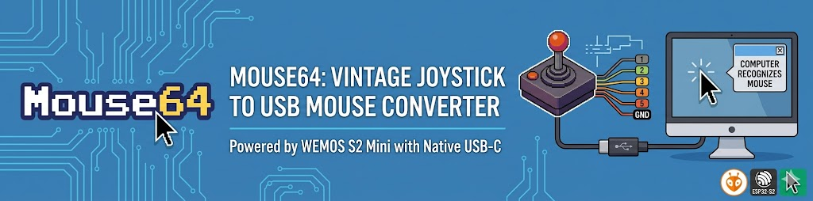
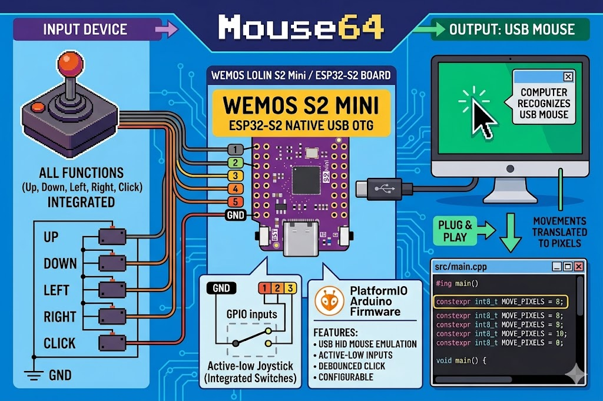

# 🖱️ Mouse64



Use a joystick or push buttons as a USB mouse on a modern computer, powered by a
WEMOS LOLIN S2 Mini / ESP32-S2 board.

The firmware is a PlatformIO Arduino project for the WEMOS S2 Mini. The ESP32-S2
has native USB OTG, so it can enumerate directly as a USB HID mouse when plugged
into a computer over USB-C.

Board reference: <https://www.wemos.cc/en/latest/s2/s2_mini.html>

## ✨ Features

- 🖱️ USB HID mouse emulation.
- ⬇️ Active-low GPIO inputs for up, down, left, right, and left click.
- ↔️ Configurable movement step in pixels.
- ⏱️ Configurable movement repeat interval.
- 🔘 Debounced click input.

## ⚙️ Firmware Configuration

Edit the constants at the top of `src/main.cpp`:

```cpp
constexpr int8_t MOVE_PIXELS = 8;
constexpr uint16_t MOVE_REPEAT_MS = 20;
constexpr uint16_t DEBOUNCE_MS = 25;
constexpr bool INPUT_ACTIVE_HIGH = false;
```

`MOVE_PIXELS` is the number of pixels sent on every movement tick. Increase it
for a faster pointer, or decrease it for finer movement.

## 📌 Default Pin Mapping

The default wiring uses pins exposed on the WEMOS S2 Mini headers:

| Function | ESP32-S2 GPIO | S2 Mini label | Active state |
| --- | ---: | --- | --- |
| ⬆️ Up | GPIO1 | `1` | Low / GND |
| ⬇️ Down | GPIO2 | `2` | Low / GND |
| ⬅️ Left | GPIO3 | `3` | Low / GND |
| ➡️ Right | GPIO4 | `4` | Low / GND |
| 🔘 Left click | GPIO5 | `5` | Low / GND |
| ⏚ Common | GND | `GND` | Switch common |

These pins are exposed on the WEMOS S2 Mini header shown in the board pinout:
labels `1`, `2`, `3`, `4`, and `5` are available on the left side of the board.

The firmware enables internal pull-ups, so each input rests at HIGH and becomes
active when connected to `GND`.

## 🔌 Connection Schema

Active-low button wiring:



```text
WEMOS S2 Mini                         Buttons / joystick switches
-------------                         ---------------------------

GND   --------------------------------+----[ UP switch ]---- GPIO1
                                      |
                                      +----[ DOWN switch ]-- GPIO2
                                      |
                                      +----[ LEFT switch ]-- GPIO3
                                      |
                                      +----[ RIGHT switch ]- GPIO4
                                      |
                                      +----[ CLICK switch ]- GPIO5

USB-C -------------------------------- Computer
```

Equivalent table:

```text
Button common side: connect to S2 Mini GND
UP other side:      connect to GPIO1
DOWN other side:    connect to GPIO2
LEFT other side:    connect to GPIO3
RIGHT other side:   connect to GPIO4
CLICK other side:   connect to GPIO5
```

Do not connect button inputs to 5V. ESP32-S2 GPIOs are 3.3V only.

## 🧰 Resistors

No external resistor is required for the default switch circuit. The firmware
uses `INPUT_PULLUP`, so the ESP32-S2 holds each input HIGH internally and the
switch pulls the input to `GND` only while pressed.

For short wires and normal push buttons or a C64-style joystick, the internal
pull-ups are normally enough. If you use long cables or the pointer moves from
electrical noise, add one external pull-up resistor per input, from the GPIO pin
to `3.3V`. A value between `4.7 kOhm` and `10 kOhm` is typical.

## 🚀 Build and Upload

Create a Python virtual environment and install PlatformIO:

```sh
python3 -m venv .venv
source .venv/bin/activate
python -m pip install --upgrade pip
python -m pip install platformio
```

Build the firmware:

```sh
source .venv/bin/activate
pio run
```

Flash the WEMOS S2 Mini over USB-C:

```sh
source .venv/bin/activate
pio run -t upload
```

If PlatformIO cannot detect the port automatically, pass it explicitly:

```sh
pio run -t upload --upload-port /dev/ttyACM0
```

Open the serial monitor if needed:

```sh
pio device monitor
```

The board should appear to the connected computer as a USB mouse. Pulling one
direction input to `GND` moves the pointer repeatedly in that direction. Pulling
the click input to `GND` holds the left mouse button down; releasing it releases
the button.

## 🔁 Active-High Wiring

A typical C64 joystick uses a common ground and active-low switches, which is the
default configuration above. If you want active-high buttons instead, change this
constant:

```cpp
constexpr bool INPUT_ACTIVE_HIGH = true;
```

Then wire the button common to `3.3V` instead of `GND`. In that mode, the
firmware uses internal pulldowns.
